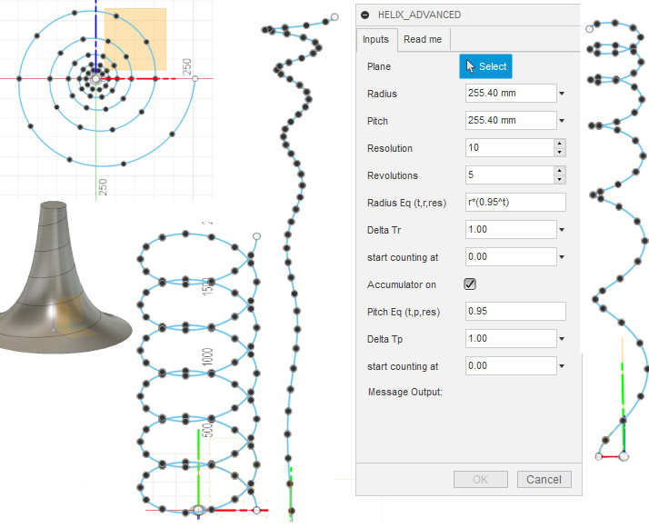

# HelixGenerator_advanced
Fusion 360 helical curves and helix generator with advanced features  
Note: this curve is an approximation of a helix and not a true mathematical helix.

# Installation

[Click here to download the Add-in](https://github.com/gilcos28/HelixGenerator_advanced/archive/master.zip)

In the downloaded folder "Helix Advanced Generator" you will find the installation instruction file "How to Install.docx"

You can get additional information from this [link](https://tapnair.github.io/installation.html)

## Usage:
Select a plane or planar face and let it generate a helix from the origin of that plane or face
Utilize the advanced features to shape it in different ways for your project
Read the README TAB for more information

## License
Samples are licensed under the terms of the [BSD-3](https://opensource.org/licenses/BSD-3-Clause). 

## Written by

Written by [Gil Cohen](https://bananafilm.com) Based on Patrick Rainsberry [HelixGenerator](https://github.com/tapnair/HelixGenerator)  

See more useful [Fusion 360 Utilities](https://tapnair.github.io/index.html)
